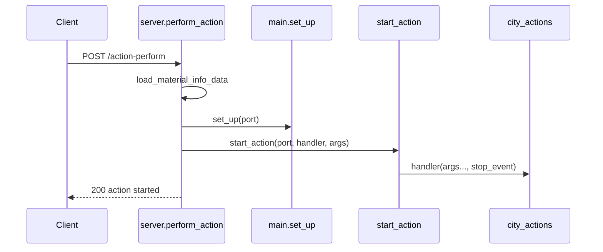

# Action Guides — Shared Infrastructure

[← Back to docs index](../README.md)

This folder contains **functional understanding guides** for each action dispatched by `POST /action-perform` in [`simcity/bot/server.py`](../../simcity/bot/server.py). For the HTTP contract, see [API reference](../api.md). For technical handler summaries, see [city-actions](../city-actions.md).

## Action guide index

| Action | Guide |
|--------|-------|
| `CONTINUOUS_BUY` | [continuous-buy.md](continuous-buy.md) |
| `SELL_WITH_FULL_VALUE` | [sell-with-full-value.md](sell-with-full-value.md) |
| `SELL_WITH_ZERO_VALUE` | [sell-with-zero-value.md](sell-with-zero-value.md) |
| `COLLECT_FROM_FACTORY` | [collect-from-factory.md](collect-from-factory.md) |
| `ADD_COMMERCIAL_MATERIAL_TO_PRODUCTION` | [add-commercial-to-production.md](add-commercial-to-production.md) |
| `ADD_RAW_MATERIAL_TO_PRODUCTION` | [add-raw-to-production.md](add-raw-to-production.md) |
| `ADVERTISE_ITEM_ON_TRADE_DEPOT` | [advertise-on-trade-depot.md](advertise-on-trade-depot.md) |

## Request lifecycle

Every action follows the same path from HTTP request to background automation thread:



### Step-by-step

1. **Client** sends `POST /action-perform` with JSON body.
2. **`perform_action`** reads `port`, `action`, `selectedMaterials`, and `factoriesCount`.
3. **`load_material_info_data()`** loads or returns cached `MaterialInfo` objects from [`material_data_loader`](../../simcity/bot/material_data_loader.py).
4. **`set_up(city_port)`** in [`main.py`](../../simcity/bot/main.py) configures logging and connects ADB to `127.0.0.1:{port}`.
5. If `selectedMaterials` is non-empty, each enum name string is resolved to a `MaterialInfo` and appended to `select_material_list`. A `material_priorities` map is also built (`Material[name] → index + 1`) but **is not passed to any handler today**.
6. The `action` string selects a `city_actions` handler; **`start_action(city_port, handler, args)`** spawns a daemon thread.
7. Server immediately returns `{"message": "action started"}` with HTTP 200.

Unknown actions return `{"message": "unknown action"}` — also HTTP 200 (no 4xx validation today).

## Request fields

| Field | Type | Required | Description |
|-------|------|----------|-------------|
| `port` | string | Yes | ADB TCP port of the emulator (e.g. `"5555"` → `127.0.0.1:5555`) |
| `action` | string | Yes | Action identifier (see [action guide index](#action-guide-index)) |
| `selectedMaterials` | string[] | Varies | Material enum names in priority order (e.g. `["STORAGE_BARS", "STORAGE_LOCK"]`) |
| `factoriesCount` | number | Varies | Number of factories for factory-related actions |

Material names must match keys in [`resources/material_data/`](../../resources/material_data/) and the [`Material`](../../simcity/bot/enums/material.py) enum.

## Threading model

`start_action` in `server.py`:

```python
def start_action(city_port, target, args):
    if city_port in stop_events:
        stop_events[city_port].set()      # stop previous action

    stop_event = Event()
    stop_events[city_port] = stop_event

    thread = Thread(
        target=target,
        args=(*args, stop_event),         # stop_event always last arg
        daemon=True
    )
    running_actions[city_port] = thread
    thread.start()
```

Key behaviors:

- **One action per port** — starting a new action on the same port preempts the previous one by setting its stop event.
- **`stop_event` is always appended** as the final argument to city action functions.
- **In-memory only** — `running_actions` and `stop_events` are not persisted; server restart clears state.
- **Daemon threads** — do not prevent process exit.

## Stopping an action

`POST /action-stop` with body `{"port": "5555"}` sets the cooperative stop event for that port.

Stop is **cooperative** — each handler must call `stop_event.is_set()` in its loops. Effectiveness varies by action; see each guide's "Stop & concurrency" section.

| Condition | Response |
|-----------|----------|
| Port has a registered stop event | `{"message": "action stop requested"}` |
| No running action for port | `{"message": "no running action for this city"}` |

## Related documents

- [API reference](../api.md) — endpoints, curl examples, dispatch table
- [City actions](../city-actions.md) — technical handler reference
- [Architecture](../architecture.md) — layers and concurrency
- [Automation](../automation.md) — low-level primitives used by handlers
- [Data and enums](../data-and-enums.md) — `MaterialInfo` fields
