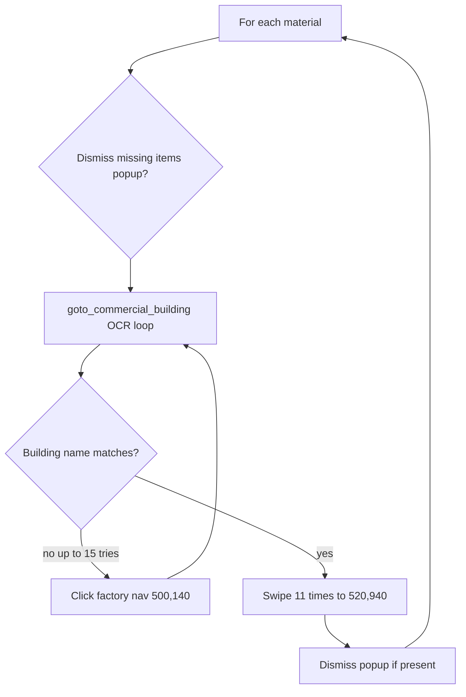

# ADD_COMMERCIAL_MATERIAL_TO_PRODUCTION — Queue Commercial Materials

[← Action guides index](README.md) · [API reference](../api.md)

**Summary:** For each selected commercial material, navigates to its production building and drags the material into the production queue repeatedly (11 times per material by default).

## When to use

- Fill commercial building production queues (hardware store, donut shop, etc.) after collecting or buying inputs.
- Queue multiple commercial products in one API call — processing order follows `selectedMaterials`.
- Automate repetitive drag-and-drop into production slots.

## API contract

| Field | Required | Usage |
|-------|----------|-------|
| `port` | Yes | Emulator ADB port |
| `action` | Yes | `"ADD_COMMERCIAL_MATERIAL_TO_PRODUCTION"` |
| `selectedMaterials` | Yes (practically) | All materials processed in list order |
| `factoriesCount` | No | Ignored |

### Example request

```bash
curl -X POST http://127.0.0.1:5000/action-perform \
  -H "Content-Type: application/json" \
  -d "{\"port\": \"5555\", \"action\": \"ADD_COMMERCIAL_MATERIAL_TO_PRODUCTION\", \"selectedMaterials\": [\"NAILS\", \"PLANKS\"]}"
```

### Handler signature

```python
add_commercial_material_to_production(materials, device_id, stop_event, no_of_materials=11)
```

| Argument | Source |
|----------|--------|
| `materials` | Full `select_material_list` |
| `device_id` | `port` |
| `stop_event` | Appended by `start_action` |
| `no_of_materials` | Default 11 (not exposed via API) |

## Dispatch mapping

```78:83:simcity/bot/server.py
    elif request_data['action'] == 'ADD_COMMERCIAL_MATERIAL_TO_PRODUCTION':
        start_action(
            city_port,
            add_commercial_material_to_production,
            (select_material_list, city_port)
        )
```

Enum: [`CityAction.ADD_COMMERCIAL_MATERIAL_TO_PRODUCTION`](../../simcity/bot/enums/city_actions.py) — handler: [`add_commercial_material_to_production.py`](../../simcity/bot/city_actions/add_commercial_material_to_production.py).

## In-game behavior

For each material in `selectedMaterials`:

1. Dismisses a "missing items" popup if the `MISSING_ITEMS` template is visible (clicks `(710, 795)`).
2. **`goto_commercial_building`** — up to 15 attempts:
   - OCR reads the building name from region `(690, 105)`–`(1250, 165)`.
   - Compares against keyword substrings for the material's `building_name` (from `MaterialInfo`).
   - If no match, clicks factory navigation `(500, 140)` to cycle buildings.
3. Performs **11 drag gestures** from `(material.x_location, material.y_location)` to production slot `(520, 940)`.
4. Dismisses missing-items popup again after the swipe loop.

## Flow diagram



## Automation dependencies

| Type | Used for |
|------|----------|
| ADB clicks / swipes | Popup dismiss, building navigation, production drag |
| Template matching | `MISSING_ITEMS` dialog detection |
| OCR | Building name in header via `take_screenshot_and_read_text` |
| Material data | `x_location`, `y_location`, `building_name` from `MaterialInfo` JSON |

Key primitives: [`perform_swipe`](../../simcity/bot/automation/adb_actions.py), [`take_screenshot_and_read_text`](../../simcity/bot/automation/take_screenshot_and_read_text.py). Building keywords from [`Building`](../../simcity/bot/enums/building.py) enum. See [data-and-enums](../data-and-enums.md) and [automation](../automation.md).

## Prerequisites & assumptions

- Material JSON includes valid `building_name`, `x_location`, and `y_location`.
- Commercial buildings are reachable by cycling factory navigation.
- OCR can read building names (typo-tolerant via keyword substrings).
- Production destination `(520, 940)` is correct for the emulator resolution.

## Stop & concurrency

| Mechanism | Effect |
|-----------|--------|
| `POST /action-stop` | **Effective** — checked between materials and between swipes |
| New action on same port | Preempts via stop event |

## Limitations & known gaps

- If building navigation fails after 15 attempts, swipes still run on the **wrong** building.
- Fixed swipe destination `(520, 940)` — not material-specific.
- No confirmation that production was actually queued.
- `no_of_materials=11` is hardcoded; not configurable via API.
- OCR keyword for VU Random Generator has a typo: `"vu's random gnerator"`.
- `material_priorities` is computed in `perform_action` but never used.

## Related code

- Handler: [`simcity/bot/city_actions/add_commercial_material_to_production.py`](../../simcity/bot/city_actions/add_commercial_material_to_production.py)
- Enum: `CityAction.ADD_COMMERCIAL_MATERIAL_TO_PRODUCTION` in [`city_actions.py`](../../simcity/bot/enums/city_actions.py)
- Technical reference: [city-actions — add_commercial_material_to_production](../city-actions.md#add_commercial_material_to_productionpy)
