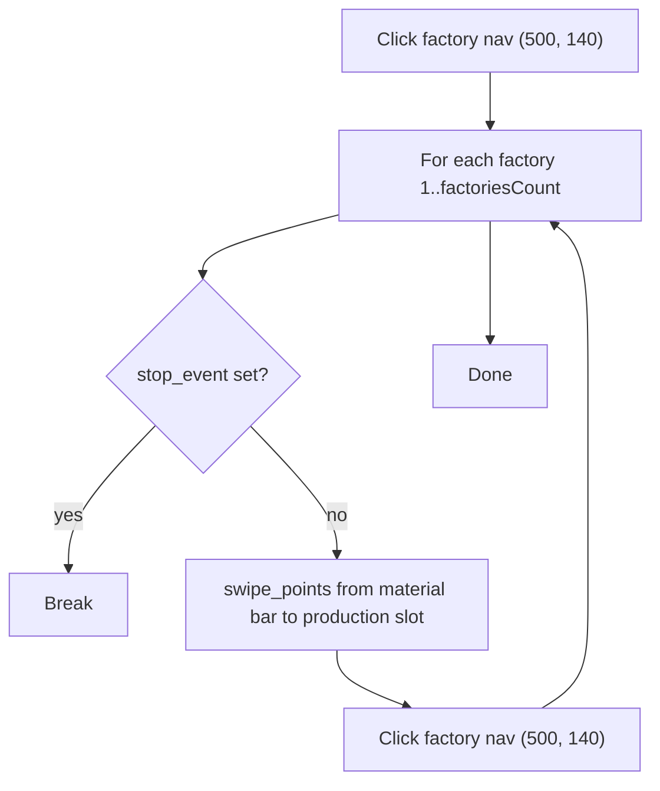

# ADD_RAW_MATERIAL_TO_PRODUCTION — Queue Raw Materials in Factories

[← Action guides index](README.md) · [API reference](../api.md)

**Summary:** Drags a single raw material from the material bar into each factory's production slot, visiting `factoriesCount` factories in one pass.

## When to use

- Start or refill raw material production (metal, wood, plastic, etc.) across multiple factories.
- Pair with [collect-from-factory.md](collect-from-factory.md) in a produce → collect cycle.
- Automate the drag-from-material-bar gesture that would otherwise be done manually per factory.

## API contract

| Field | Required | Usage |
|-------|----------|-------|
| `port` | Yes | Emulator ADB port |
| `action` | Yes | `"ADD_RAW_MATERIAL_TO_PRODUCTION"` |
| `selectedMaterials` | Yes (practically) | **First material only** is used |
| `factoriesCount` | Yes | Number of factories to fill |

### Example request

```bash
curl -X POST http://127.0.0.1:5000/action-perform \
  -H "Content-Type: application/json" \
  -d "{\"port\": \"5555\", \"action\": \"ADD_RAW_MATERIAL_TO_PRODUCTION\", \"selectedMaterials\": [\"METAL\"], \"factoriesCount\": 12}"
```

### Handler signature

```python
add_raw_material_to_production(material, no_of_factories, device_id, stop_event)
```

| Argument | Source |
|----------|--------|
| `material` | `MaterialInfo` from `selectedMaterials[0]` |
| `no_of_factories` | `factoriesCount` |
| `device_id` | `port` |
| `stop_event` | Appended by `start_action` |

## Dispatch mapping

```85:90:simcity/bot/server.py
    elif request_data['action'] == 'ADD_RAW_MATERIAL_TO_PRODUCTION':
        start_action(
            city_port,
            add_raw_material_to_production,
            (select_material_list[0], request_data['factoriesCount'], city_port)
        )
```

Enum: [`CityAction.ADD_RAW_MATERIAL_TO_PRODUCTION`](../../simcity/bot/enums/city_actions.py) — handler: [`add_raw_material_to_production.py`](../../simcity/bot/city_actions/add_raw_material_to_production.py).

## In-game behavior

1. Clicks factory navigation at `(500, 140)` to enter factory view.
2. Connects uiautomator2 to `127.0.0.1:{port}`.
3. For each factory from 1 to `factoriesCount`:
   - Performs a multi-point drag via `swipe_points`:
     - Start: `(material.x_location, material.y_location)` from material JSON
     - Waypoints: `(380, 935)` → `(1260, 1000)`
     - Duration: 0.2s
   - Clicks `(500, 140)` to advance to the next factory.
   - Waits 0.5 seconds.
4. Exits after one complete pass.

## Flow diagram



## Automation dependencies

| Type | Used for |
|------|----------|
| ADB clicks | Factory navigation |
| uiautomator2 | `swipe_points` multi-point drag gesture |
| Material data | `x_location`, `y_location` from `MaterialInfo` JSON |

No screenshots or OCR. See [data-and-enums](../data-and-enums.md) and [automation](../automation.md).

## Prerequisites & assumptions

- Material JSON has correct `x_location` and `y_location` for the material bar icon.
- Factory navigation at `(500, 140)` cycles through factories correctly.
- Hardcoded swipe waypoints `(380, 935)` and `(1260, 1000)` match the emulator resolution.
- Game is on a screen where factory production slots are reachable via this drag path.

## Stop & concurrency

| Mechanism | Effect |
|-----------|--------|
| `POST /action-stop` | **Effective** — checked once per factory iteration |
| New action on same port | Preempts via stop event |

## Limitations & known gaps

- **IndexError** if `selectedMaterials` is empty (`select_material_list[0]`).
- Hardcoded swipe path — resolution and layout dependent.
- Very short 0.1s sleep after swipe may be insufficient on slower devices.
- No verification that material was added to production.
- Single pass only; not continuous.
- Only the **first** material in `selectedMaterials` is used.

## Related code

- Handler: [`simcity/bot/city_actions/add_raw_material_to_production.py`](../../simcity/bot/city_actions/add_raw_material_to_production.py)
- Enum: `CityAction.ADD_RAW_MATERIAL_TO_PRODUCTION` in [`city_actions.py`](../../simcity/bot/enums/city_actions.py)
- Technical reference: [city-actions — add_raw_material_to_production](../city-actions.md#add_raw_material_to_productionpy)
- Companion action: [collect-from-factory.md](collect-from-factory.md)
