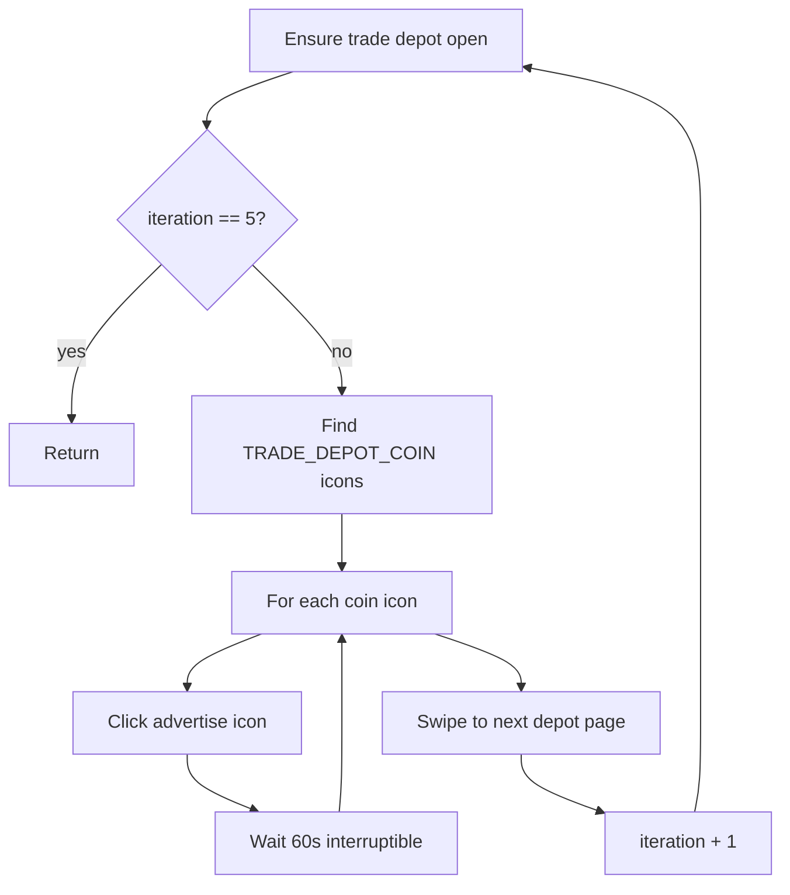

# ADVERTISE_ITEM_ON_TRADE_DEPOT — Advertise Trade Depot Listings

[← Action guides index](README.md) · [API reference](../api.md)

**Summary:** Intended to find sold trade depot items (coin icons), click advertise on each, and wait 60 seconds per item across up to 5 depot pages. **Not currently wired to the API** — the server accepts the action but performs no automation.

## When to use

*Not available via API today.* When implemented, this would be used to:

- Advertise all sold items in the trade depot to speed up buyer visits.
- Run after [sell-with-full-value.md](sell-with-full-value.md) or [sell-with-zero-value.md](sell-with-zero-value.md) once items sell.

## API contract

| Field | Required | Usage |
|-------|----------|-------|
| `port` | Yes | Emulator ADB port |
| `action` | Yes | `"ADVERTISE_ITEM_ON_TRADE_DEPOT"` |
| `selectedMaterials` | No | Would be ignored by the unwired handler |
| `factoriesCount` | No | Ignored |

### Example request (no effect today)

```bash
curl -X POST http://127.0.0.1:5000/action-perform \
  -H "Content-Type: application/json" \
  -d "{\"port\": \"5555\", \"action\": \"ADVERTISE_ITEM_ON_TRADE_DEPOT\", \"selectedMaterials\": []}"
```

### Response

```json
{"message": "action started"}
```

The server returns success, but only prints `no action mapped` to the console — no background thread is started.

## Dispatch mapping (current — stub only)

```75:76:simcity/bot/server.py
    elif request_data['action'] == 'ADVERTISE_ITEM_ON_TRADE_DEPOT':
        print('no action mapped')
```

Enum: [`CityAction.ADVERTISE_ITEM_ON_TRADE_DEPOT`](../../simcity/bot/enums/city_actions.py).

## Intended in-game behavior (unwired handler)

The implementation exists in [`advertise_all_items_on_trade_depot.py`](../../simcity/bot/city_actions/advertise_all_items_on_trade_depot.py) but is **not imported or dispatched** by `server.py`:

```python
def advertise_all_items_on_trade_depot(iteration, device_id, stop_event)
```

Planned flow:

1. Ensure trade depot is open (`check_if_trade_depot_open` → `find_and_open_trade_depot` if not).
2. Find `TRADE_DEPOT_COIN` icons (sold items).
3. For each coin icon:
   - Click the listing.
   - Find and click `ADVERTISE_ICON`.
   - Wait 60 seconds (stop-checked each second).
4. Swipe to next depot page; recurse with `iteration + 1` until `iteration == 5`.

## Flow diagram (intended)



## Automation dependencies (intended)

| Type | Used for |
|------|----------|
| ADB clicks / swipes | Depot navigation, advertise UI |
| Template matching | `TRADE_DEPOT_COIN`, `ADVERTISE_ICON` |

See [automation](../automation.md).

## Prerequisites & assumptions (intended)

- Trade depot accessible from current game screen.
- Sold items show coin icons detectable by template matching.

## Stop & concurrency (intended handler)

| Mechanism | Effect |
|-----------|--------|
| `POST /action-stop` | Would be effective — checked at entry, per item, and each second during 60s wait |
| New action on same port | Would preempt via stop event |

**Today:** No thread is started, so stop has no effect.

## Limitations & known gaps

1. **Server stub** — `perform_action` only prints `no action mapped`; no `start_action` call.
2. **Handler not wired** — `advertise_all_items_on_trade_depot` is not imported in `server.py`.
3. **Broken import** — handler imports `check_if_trade_depot_open` from [`trade_depot.py`](../../simcity/bot/automation/trade_depot.py), but that function is **not defined** there (only `find_and_open_trade_depot` exists). Loading the module raises `ImportError`.
4. **Same broken import** affects [`collect_sold_item_money.py`](../../simcity/bot/city_actions/collect_sold_item_money.py).
5. **`sell_materials` advertise flag** — `sell_materials` supports `advertise=True`, but both sell API actions pass `False`.
6. **No material selection** — advertise-all flow is material-agnostic; `selectedMaterials` would be unused.

### Recommended future wiring (not implemented)

```python
from simcity.bot.city_actions.advertise_all_items_on_trade_depot import advertise_all_items_on_trade_depot

elif request_data['action'] == 'ADVERTISE_ITEM_ON_TRADE_DEPOT':
    start_action(
        city_port,
        advertise_all_items_on_trade_depot,
        (0, city_port)
    )
```

Requires fixing `check_if_trade_depot_open` in `trade_depot.py` first.

## Related code

- Stub: [`simcity/bot/server.py`](../../simcity/bot/server.py) lines 75–76
- Unwired handler: [`simcity/bot/city_actions/advertise_all_items_on_trade_depot.py`](../../simcity/bot/city_actions/advertise_all_items_on_trade_depot.py)
- Enum: `CityAction.ADVERTISE_ITEM_ON_TRADE_DEPOT` in [`city_actions.py`](../../simcity/bot/enums/city_actions.py)
- Technical reference: [city-actions — advertise_all_items_on_trade_depot](../city-actions.md#advertise_all_items_on_trade_depotpy)
