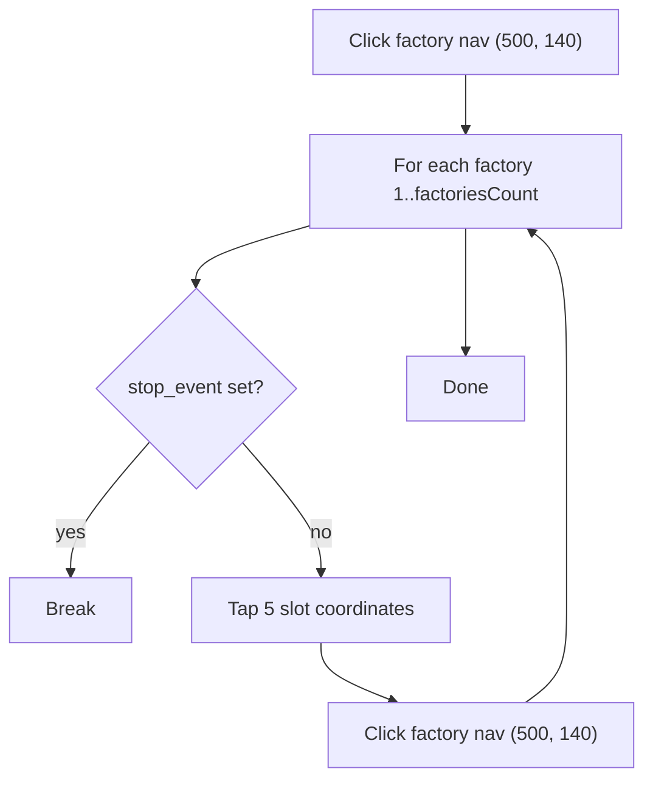

# COLLECT_FROM_FACTORY — Collect Raw Materials from Factories

[← Action guides index](README.md) · [API reference](../api.md)

**Summary:** Performs a single pass over all factories, tapping five fixed production-slot coordinates per factory to collect finished raw materials.

## When to use

- Collect produced items (metal, wood, plastic, etc.) after production timers complete.
- Run periodically between `ADD_RAW_MATERIAL_TO_PRODUCTION` cycles.
- Batch-collect across many factories in one short automation run.

## API contract

| Field | Required | Usage |
|-------|----------|-------|
| `port` | Yes | Emulator ADB port |
| `action` | Yes | `"COLLECT_FROM_FACTORY"` |
| `selectedMaterials` | No | **Ignored** |
| `factoriesCount` | Yes | Number of factories to visit |

### Example request

```bash
curl -X POST http://127.0.0.1:5000/action-perform \
  -H "Content-Type: application/json" \
  -d "{\"port\": \"5555\", \"action\": \"COLLECT_FROM_FACTORY\", \"selectedMaterials\": [], \"factoriesCount\": 12}"
```

### Handler signature

```python
collect_raw_materials(no_of_factories, device_id, stop_event)
```

| Argument | Source |
|----------|--------|
| `no_of_factories` | `factoriesCount` |
| `device_id` | `port` |
| `stop_event` | Appended by `start_action` |

## Dispatch mapping

```68:73:simcity/bot/server.py
    elif request_data['action'] == 'COLLECT_FROM_FACTORY':
        start_action(
            city_port,
            collect_raw_materials,
            (request_data['factoriesCount'], city_port)
        )
```

Enum: [`CityAction.COLLECT_FROM_FACTORY`](../../simcity/bot/enums/city_actions.py) — handler: [`collect_raw_materials.py`](../../simcity/bot/city_actions/collect_raw_materials.py).

## In-game behavior

1. Clicks factory navigation at `(500, 140)` to enter factory view.
2. For each factory from 1 to `factoriesCount`:
   - Taps five collection slot coordinates in a row:
     - `(375, 1025)`, `(595, 1025)`, `(810, 1025)`, `(1030, 1025)`, `(1240, 1025)`
   - Waits 0.5 seconds.
   - Re-clicks `(500, 140)` to advance to the next factory.
3. Exits after one complete pass (not a continuous loop).

## Flow diagram



## Automation dependencies

| Type | Used for |
|------|----------|
| ADB clicks only | Fixed-coordinate taps — no screenshots, OCR, or template matching |

Key primitive: [`perform_click`](../../simcity/bot/automation/adb_actions.py). See [automation](../automation.md).

## Prerequisites & assumptions

- Game is on a screen where factory navigation at `(500, 140)` cycles through factories.
- Emulator resolution matches hardcoded pixel coordinates.
- Production slots are in the expected horizontal layout at y≈1025.
- Items are ready to collect in the tapped slots (no verification).

## Stop & concurrency

| Mechanism | Effect |
|-----------|--------|
| `POST /action-stop` | **Effective** — checked once per factory iteration (`break` on set) |
| New action on same port | Preempts via stop event |

## Limitations & known gaps

- **Resolution-dependent** — fixed coordinates will mis-tap on different screen sizes.
- No verification that collection succeeded or that slots had items.
- Single pass only; does not loop continuously.
- `selectedMaterials` is ignored entirely.
- Minimal delay between slot clicks (only 0.5s after the batch).

## Related code

- Handler: [`simcity/bot/city_actions/collect_raw_materials.py`](../../simcity/bot/city_actions/collect_raw_materials.py)
- Enum: `CityAction.COLLECT_FROM_FACTORY` in [`city_actions.py`](../../simcity/bot/enums/city_actions.py)
- Technical reference: [city-actions — collect_raw_materials](../city-actions.md#collect_raw_materialspy)
- Companion action: [add-raw-to-production.md](add-raw-to-production.md)
