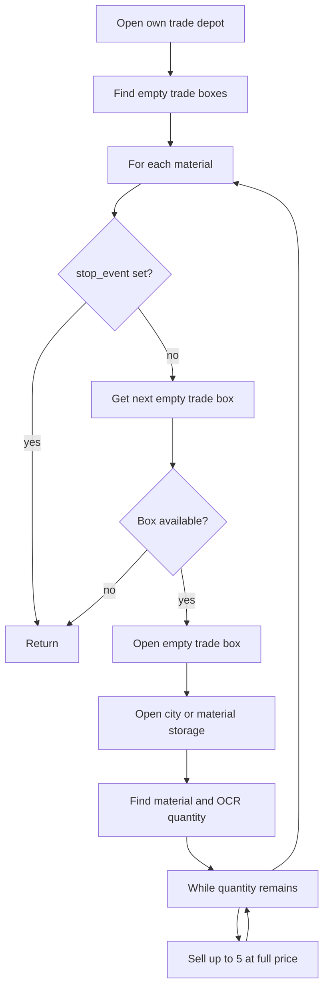

# SELL_WITH_FULL_VALUE — Sell Materials at Full Price

[← Action guides index](README.md) · [API reference](../api.md)

**Summary:** Lists selected materials from city storage into empty trade depot slots at **maximum price**, selling in batches of up to 5 units per listing.

## When to use

- List commercial or factory materials for sale at the highest allowed price.
- Clear inventory from city storage or material storage into trade depot slots.
- Process multiple materials in one run — order follows `selectedMaterials` array.

## API contract

| Field | Required | Usage |
|-------|----------|-------|
| `port` | Yes | Emulator ADB port |
| `action` | Yes | `"SELL_WITH_FULL_VALUE"` |
| `selectedMaterials` | Yes (practically) | All materials processed in list order |
| `factoriesCount` | No | Ignored |

### Example request

```bash
curl -X POST http://127.0.0.1:5000/action-perform \
  -H "Content-Type: application/json" \
  -d "{\"port\": \"5555\", \"action\": \"SELL_WITH_FULL_VALUE\", \"selectedMaterials\": [\"STORAGE_BARS\", \"STORAGE_LOCK\"]}"
```

### Handler signature

```python
sell_materials(materials, device_id, advertise, full_price, stop_event,
               max_city_storage_scrolls=15, max_depot_pages=4)
```

| Argument | Server value |
|----------|--------------|
| `materials` | Full `select_material_list` |
| `device_id` | `port` |
| `advertise` | `False` |
| `full_price` | `True` |
| `stop_event` | Appended by `start_action` |

## Dispatch mapping

```54:59:simcity/bot/server.py
    elif request_data['action'] == 'SELL_WITH_FULL_VALUE':
        start_action(
            city_port,
            sell_materials,
            (select_material_list, city_port, False, True)
        )
```

Enum: [`CityAction.SELL_WITH_FULL_VALUE`](../../simcity/bot/enums/city_actions.py) — handler: [`sell_materials.py`](../../simcity/bot/city_actions/sell_materials.py).

For zero-price selling, see [sell-with-zero-value.md](sell-with-zero-value.md).

## In-game behavior

1. Opens purchase menu → own trade depot.
2. Scans for empty trade boxes on the current depot page.
3. For each material in `selectedMaterials`:
   - Gets the next empty trade box (paginates depot up to 4 pages if needed).
   - Opens the empty box.
   - Opens the correct storage: **material storage** for factory items, **city storage** for commercial items.
   - Scrolls storage (up to 15 pages) to find the material; OCR reads quantity from the first match.
   - Sells in batches of up to 5 via `sell_material` with **full price** (swipe up on price slider).
   - Opens additional empty boxes if quantity remains and depot has space.
4. Stops early if the depot is full or quantity is zero.

## Flow diagram



## Automation dependencies

| Type | Used for |
|------|----------|
| ADB clicks | Trade depot, storage navigation, sell UI |
| Template matching | `EMPTY_TRADE_BOXES`, `BUY_ICON`, material icons in storage |
| OCR | `capture_material_quantity` on quantity region |

Key primitives: [`open_empty_trade_box`](../../simcity/bot/automation/open_empty_trade_box.py), [`sell_material`](../../simcity/bot/automation/sell_material.py), [`find_material_in_city_storage`](../../simcity/bot/automation/find_material.py). See [automation](../automation.md).

## Prerequisites & assumptions

- Trade depot has at least one empty slot (or action exits after scanning).
- Material templates exist in material JSON for template matching.
- Commercial vs factory storage routing depends on material type in `MaterialInfo`.
- OCR can read the quantity number in the storage UI region.

## Stop & concurrency

| Mechanism | Effect |
|-----------|--------|
| `POST /action-stop` | **Effective** — checked at entry, after navigation, per material, per storage page, and inside sell loop |
| New action on same port | Preempts via stop event |

## Limitations & known gaps

- `advertise` is always `False` from the API — no route enables advertising during sell.
- Assumes batch size of 5 per listing.
- Returns early (skips remaining materials) if depot is full mid-run.
- OCR failure on quantity can raise an exception.
- `get_next_empty_trade_box` clicks all visible `BUY_ICON` overlays as cleanup side effect.

## Related code

- Handler: [`simcity/bot/city_actions/sell_materials.py`](../../simcity/bot/city_actions/sell_materials.py)
- Enum: `CityAction.SELL_WITH_FULL_VALUE` in [`city_actions.py`](../../simcity/bot/enums/city_actions.py)
- Technical reference: [city-actions — sell_materials](../city-actions.md#sell_materialspy)
- Companion action: [sell-with-zero-value.md](sell-with-zero-value.md)
