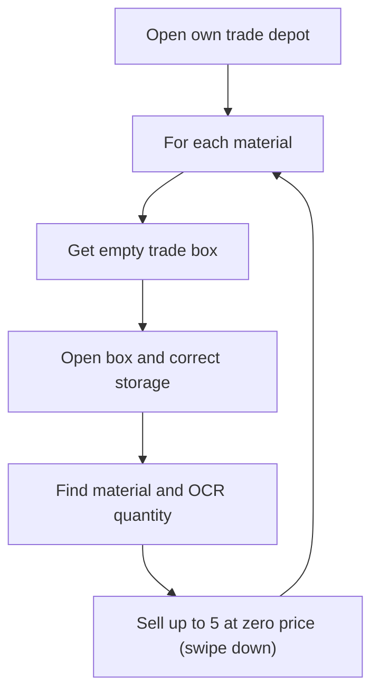

# SELL_WITH_ZERO_VALUE — Sell Materials at Zero Price

[← Action guides index](README.md) · [API reference](../api.md)

**Summary:** Lists selected materials from city storage into empty trade depot slots at **zero (minimum) price**, selling in batches of up to 5 units per listing.

## When to use

- Dump excess inventory quickly without caring about simoleon return.
- Free trade depot slots or clear storage for other materials.
- Same multi-material workflow as full-price sell, but with minimum listing price.

## API contract

| Field | Required | Usage |
|-------|----------|-------|
| `port` | Yes | Emulator ADB port |
| `action` | Yes | `"SELL_WITH_ZERO_VALUE"` |
| `selectedMaterials` | Yes (practically) | All materials processed in list order |
| `factoriesCount` | No | Ignored |

### Example request

```bash
curl -X POST http://127.0.0.1:5000/action-perform \
  -H "Content-Type: application/json" \
  -d "{\"port\": \"5555\", \"action\": \"SELL_WITH_ZERO_VALUE\", \"selectedMaterials\": [\"STORAGE_BARS\", \"STORAGE_LOCK\"]}"
```

### Handler signature

```python
sell_materials(materials, device_id, advertise, full_price, stop_event,
               max_city_storage_scrolls=15, max_depot_pages=4)
```

| Argument | Server value |
|----------|--------------|
| `materials` | Full `select_material_list` |
| `device_id` | `port` |
| `advertise` | `False` |
| `full_price` | `False` |
| `stop_event` | Appended by `start_action` |

## Dispatch mapping

```61:66:simcity/bot/server.py
    elif request_data['action'] == 'SELL_WITH_ZERO_VALUE':
        start_action(
            city_port,
            sell_materials,
            (select_material_list, city_port, False, False)
        )
```

Enum: [`CityAction.SELL_WITH_ZERO_VALUE`](../../simcity/bot/enums/city_actions.py) — handler: [`sell_materials.py`](../../simcity/bot/city_actions/sell_materials.py).

For full-price selling, see [sell-with-full-value.md](sell-with-full-value.md).

## In-game behavior

Identical to [SELL_WITH_FULL_VALUE](sell-with-full-value.md) except at the sell step:

- `sell_material` receives `full_price=False`, which **swipes down** on the price slider to set minimum (zero) price before confirming quantity and listing.

All other steps — depot navigation, empty box detection, storage selection, OCR quantity, batch size of 5 — are shared with the full-value action.

## Flow diagram



See [sell-with-full-value.md](sell-with-full-value.md) for the full flowchart.

## Automation dependencies

Same as [sell-with-full-value.md](sell-with-full-value.md). The only behavioral difference is the price swipe direction inside [`sell_material`](../../simcity/bot/automation/sell_material.py).

## Prerequisites & assumptions

Same as [sell-with-full-value.md](sell-with-full-value.md).

## Stop & concurrency

Same as [sell-with-full-value.md](sell-with-full-value.md) — cooperative stop is well implemented throughout the sell loop.

## Limitations & known gaps

- Same gaps as full-value sell (no API advertise flag, batch size 5, depot-full early exit, OCR risk).
- `advertise` parameter exists on `sell_materials` but API always passes `False` for both sell actions.

## Related code

- Handler: [`simcity/bot/city_actions/sell_materials.py`](../../simcity/bot/city_actions/sell_materials.py)
- Enum: `CityAction.SELL_WITH_ZERO_VALUE` in [`city_actions.py`](../../simcity/bot/enums/city_actions.py)
- Technical reference: [city-actions — sell_materials](../city-actions.md#sell_materialspy)
- Companion action: [sell-with-full-value.md](sell-with-full-value.md)
