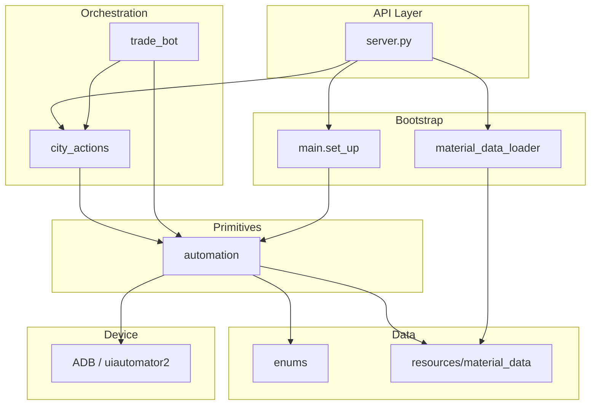

# Architecture

[← Back to index](README.md)

## Layered design

The bot follows a four-layer architecture. Each layer depends only on layers below it.

| Layer | Responsibility | Key modules |
|-------|----------------|-------------|
| **API** | HTTP routes, per-port threading, action dispatch | [`server.py`](../simcity/bot/server.py) |
| **Bootstrap** | Logging, ADB connect, global timers, material cache | [`main.py`](../simcity/bot/main.py), [`logger.py`](../simcity/bot/logger.py) |
| **Orchestration** | Game-level workflows (buy loop, sell loop, production) | [`city_actions/`](../simcity/bot/city_actions/), [`trade_bot/`](../simcity/bot/trade_bot/) |
| **Primitives** | Screenshots, template match, OCR, fixed-coordinate clicks | [`automation/`](../simcity/bot/automation/) |
| **Data** | Material metadata, UI icon templates, enums | [`material_info.py`](../simcity/bot/material_info.py), [`enums/`](../simcity/bot/enums/), [`resources/`](../resources/) |

## Request lifecycle (API path)

1. Client sends `POST /action-perform` with `port`, `action`, and optional `selectedMaterials` / `factoriesCount`.
2. Server calls `load_material_info_data()` to resolve material name strings → `MaterialInfo` objects.
3. Server calls `set_up(city_port)` — configures logging and ensures ADB is connected to `127.0.0.1:{port}`.
4. Server maps `action` to a `city_actions` function and calls `start_action(port, fn, args)`.
5. `start_action` stops any existing action on that port, creates a new `threading.Event`, and starts a daemon thread.
6. The city action runs its loop, calling `automation/` primitives until `stop_event` is set or the loop ends.
7. Client can call `POST /action-stop` to signal the thread to exit on the next `stop_event` check.

See [API](api.md) for endpoint details and [city-actions](city-actions.md) for per-action behavior.

## Concurrency model

- **One active action per ADB port.** `running_actions` and `stop_events` dicts in `server.py` are keyed by `city_port`.
- Starting a new action on the same port **preempts** the previous one by calling `stop_events[city_port].set()` before spawning a new thread.
- Threads are **daemon** threads — they do not block server shutdown.
- **Multi-city:** run multiple emulators on different ports (e.g. `5555`, `5605`). Each port gets its own thread and stop event.
- **`trade_bot`** uses per-device timer keys (`global_trade_hq_timer_{slug}`) and optional capture folders so concurrent cities do not collide.

## Device identity

Throughout the codebase, `device_id` and `port` refer to the **ADB TCP port** of the emulator:

- Connection string: `127.0.0.1:{device_id}` (uiautomator2) or `adb connect 127.0.0.1:{device_id}` (shell)
- Screenshots saved under `screenshots/city_{device_id}/`

## Shared state

| State | Location | Scope |
|-------|----------|-------|
| `material_info_dict` | [`material_data_loader.py`](../simcity/bot/material_data_loader.py) | Process-global singleton (loaded once) |
| `material_dict` | [`main.py`](../simcity/bot/main.py) | Loaded at import time |
| `manager` (`TimerManager`) | [`main.py`](../simcity/bot/main.py) / [`buy_items.py`](../simcity/bot/city_actions/buy_items.py) | HQ refresh timing (note: `buy_items` also creates a local `TimerManager`) |
| `running_actions` / `stop_events` | [`server.py`](../simcity/bot/server.py) | In-memory, not persisted across restarts |

## Logging

[`logger.py`](../simcity/bot/logger.py) configures logging on each `set_up()` call:

- **Console** and **file** handlers at `INFO` level
- Log file: `simcity_buildit.log` (mode `w` — overwritten each session)
- Format: timestamp, filename, line number, level, message
- `CustomLogger` can prefix messages with a city name when `device_id` is passed (via `simcity.bot.cities.get_city_name_by_port`)

## Known gaps

These are documented for maintainers; they are **not** fixed in this documentation pass.

| Gap | Detail |
|-----|--------|
| `ADVERTISE_ITEM_ON_TRADE_DEPOT` | Server prints `no action mapped`; handler not wired |
| `collect_sold_item_money` | Implemented in `city_actions/` but no API route |
| `advertise_all_items_on_trade_depot` | Implemented in `city_actions/` but no API route |
| `trade_bot` | Not integrated with Flask server |
| `check_if_trade_depot_open` | Imported by `collect_sold_item_money` and `advertise_all_items_on_trade_depot` from `trade_depot.py`, but **not defined** in that file — those actions will fail at runtime if called |
| `buy_items` stop handling | `CONTINUOUS_BUY` loop does not check `stop_event` |
| Duplicate `TimerManager` | `buy_items.py` imports `main.manager` then shadows it with a new `TimerManager()` |

## Related documents

- [API](api.md) — threading and dispatch from `server.py`
- [City actions](city-actions.md) — orchestration layer detail
- [Automation](automation.md) — primitive layer detail
- [Trade bot](trade-bot.md) — parallel buy subsystem
