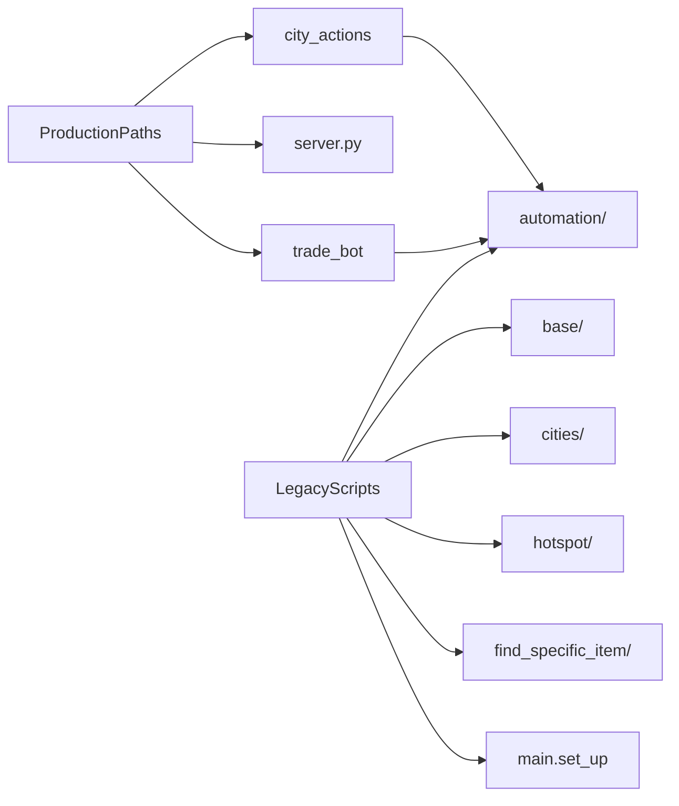

# Legacy and Experimental Modules

[← Back to index](README.md)

Beyond the production API path ([`server.py`](../simcity/bot/server.py) → [`city_actions/`](../simcity/bot/city_actions/)) and the [`trade_bot`](../simcity/bot/trade_bot/) subsystem, the package contains **standalone scripts** for one-off automation, city-specific workflows, and development experiments. These share [`main.set_up()`](../simcity/bot/main.py) and the [automation](automation.md) layer but are **not** triggered by the Flask API.

Do not confuse these with production paths documented in [API](api.md) and [city-actions](city-actions.md).

---

## Summary table

| Module | Path | Role | Status |
|--------|------|------|--------|
| Factory loops | [`base/`](../simcity/bot/base/) | Hardcoded collect + production cycles | Dev / one-off |
| City buy script | [`cities/cottonwood_forest/`](../simcity/bot/cities/cottonwood_forest/) | Older multi-material buy with `ThreadPoolExecutor` | Superseded by `trade_bot` |
| Hotspot builder | [`hotspot/`](../simcity/bot/hotspot/) | Repeated home/build hotspot placement | Experimental |
| Regional production | [`find_specific _item/`](../simcity/bot/find_specific%20_item/) | Sunshine Valley item automation | City-specific |
| Matching utils | [`multiple/`](../simcity/bot/multiple/) | Template matching experiments | Utility |
| Dev parameters | [`parameters.py`](../simcity/bot/parameters.py) | Sample material priority lists | Dev config |
| Scratch script | [`simcity/bot/run.py`](../simcity/bot/run.py) | Manual swipe/click experiments | Dev scratch |
| Tests | [`test/`](../simcity/bot/test/) | Tap/drag test scripts | Test only |

---

## `base/`

### `produce_metal.py`

Loops 8 times: `collect_raw_materials(12)` → `add_raw_material_to_production` with hardcoded metal coordinates → sleep 62s. Uses a `SimpleNamespace` instead of `MaterialInfo` for coords.

### `manufacture_nails_for_hour.py`

Similar factory automation pattern for nails production (one-off timed loop).

**Run:** execute the script directly after editing `device_id`. Calls `set_up(device_id)` at module level.

---

## `cities/cottonwood_forest/cottonwood_forest.py`

Older **multi-material Global Trade HQ buyer** for Cottonwood Forest city. Features:

- Hardcoded priority list: `STORAGE_BARS`, `STORAGE_LOCK`, `STORAGE_CAMERA`
- Own `buy_items(materials_priority_list, device_id)` distinct from [`city_actions/buy_items.py`](../simcity/bot/city_actions/buy_items.py)
- Uses `ThreadPoolExecutor` for parallel material detection
- Timer-based HQ refresh via local `TimerManager`

**Status:** Functionally overlaps with [`trade_bot`](trade-bot.md), which provides cleaner architecture and config. Kept for reference or city-specific tuning.

---

## `hotspot/hotspot_automation.py`

Automates **repeated building placement** on the city map:

1. Click home icon
2. Drag new building to target location (uiautomator2 `drag`)
3. Confirm via `CONFIRM_ICON` template match
4. Close home menu
5. Find construction hat icon and continue

Runs up to 500 iterations. Experimental — coordinates are hardcoded for a specific layout.

---

## `find_specific _item/sunshine_valley.py`

Regional automation for **Sunshine Valley** production:

- Uses fixed click coordinates and `RECYCLED_FABRIC` template matching
- Timer management for production and trade HQ cycles
- Navigates regions, limestone cliff, green valley via `city_utility_actions`

City-specific; not generalized for other regions.

---

## `multiple/matching.py`

Template matching utility experiments. Useful for developing new detection logic before integrating into [`find_material.py`](../simcity/bot/automation/find_material.py).

---

## `parameters.py`

Dev helper returning hardcoded material lists and priority maps:

```python
def get_materials():
    return ['STORAGE_BARS', 'STORAGE_LOCK', 'STORAGE_CAMERA']

def get_material_properties():
    return {
        Material.STORAGE_BARS: 1,
        Material.STORAGE_LOCK: 2,
        Material.STORAGE_CAMERA: 3,
    }
```

Commented alternatives exist for single-material (`NAILS`) testing. Consumed by legacy scripts, not the Flask server.

---

## `simcity/bot/run.py`

Ad-hoc **swipe and click experiment** script:

- Connects uiautomator2 to a hardcoded `device_id`
- Performs map swipes and home-menu interactions
- Most city action calls are commented out

Use for manual coordinate tuning, not production automation.

---

## `test/`

| File | Purpose |
|------|---------|
| [`test/test.py`](../simcity/bot/test/test.py) | General test harness |
| [`test/tapdrag.py`](../simcity/bot/test/tapdrag.py) | Tap/drag gesture tests |
| [`test/simultaneous_tap.py`](../simcity/bot/test/simultaneous_tap.py) | Multi-tap experiments |

Not part of the automation API surface.

---

## Relationship to production code



All paths ultimately depend on the [automation layer](automation.md) and ADB connectivity established by [`main.set_up()`](../simcity/bot/main.py).

---

## Related documents

- [Overview](overview.md) — package map
- [Trade bot](trade-bot.md) — recommended multi-buy replacement for `cities/`
- [Setup](setup.md) — how to run scripts locally
