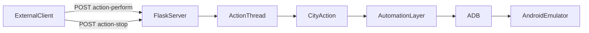

# Overview

[← Back to index](README.md)

## What this bot does

SimcityBotPune automates repetitive tasks in **SimCity BuildIt** on one or more Android emulators. Each emulator is identified by an ADB port (for example `5555`). The bot:

- **Buys** materials from other players via Global Trade HQ
- **Sells** materials from city storage into empty trade depot slots
- **Collects** finished goods from factories
- **Fills production queues** with raw or commercial materials

An external client (UI, script, or manual `curl`) can trigger these tasks through a Flask REST API. Alternatively, developers can run city actions or the `trade_bot` subsystem directly from Python.

## Tech stack

| Component | Library / tool | Role |
|-----------|----------------|------|
| HTTP API | Flask, flask-cors | Start/stop actions per emulator port |
| Device control | ADB shell, uiautomator2 | Taps, swipes, drags on emulator |
| Vision | OpenCV (`opencv-python`) | Template matching on screenshots |
| OCR | Tesseract (`pytesseract`) | Read building names, quantities |
| Timing | `threading.Event`, `TimerManager` | Stop signals and HQ refresh pacing |

See [`requirements.txt`](../requirements.txt) for pinned versions.

## System context



## Package map

```
simcity/bot/
├── server.py              # Flask API — primary production entry point
├── main.py                # Bootstrap: logging, ADB connect, Tesseract path
├── material_info.py       # MaterialInfo dataclass
├── material_data_loader.py# Load JSON → MaterialInfo dict
├── time_manager.py        # Named timers for HQ refresh cycles
├── logger.py              # Console + file logging setup
├── parameters.py          # Dev sample material priorities
├── run.py                 # Ad-hoc swipe/click experiments
│
├── city_actions/          # High-level game tasks (API-dispatched)
├── automation/            # Low-level ADB, CV, OCR, navigation (~33 modules)
├── enums/                 # Material, Building, Miscellaneous, CityAction, CityNames
│
├── trade_bot/             # Refactored multi-item Global Trade HQ buyer
│   ├── orchestrator/      # Session loop
│   ├── services/          # Detection, navigation, HQ scan, depot sweep
│   ├── models/            # PurchaseItem, DetectedItem
│   └── config/            # TradeBotConfig, YAML/JSON loaders
│
├── base/                  # One-off factory loops (metal, nails)
├── cities/                # City-specific buy scripts (superseded by trade_bot)
├── hotspot/               # Building-placement automation experiments
├── find_specific _item/   # Regional production scripts
├── multiple/              # Template-matching utilities
└── test/                  # Tap/drag test scripts
```

Template images and material metadata live under [`resources/`](../resources/) at the project root (not inside `simcity/bot/`).

## Two buy implementations

The codebase has **two** ways to buy on Global Trade HQ:

| Implementation | Entry | Materials | Status |
|----------------|-------|-----------|--------|
| **Legacy `buy_items`** | API action `CONTINUOUS_BUY` | Single material (first in `selectedMaterials`) | Wired to server |
| **`trade_bot`** | `run_trade_session()` / `run.py` | Multiple materials with priorities, parallel detection | **Not** wired to server |

For multi-item prioritized buying with configurable thresholds, use [`trade_bot`](trade-bot.md). For API-driven single-material buying, use `CONTINUOUS_BUY` — see [API](api.md) and [city-actions](city-actions.md#buy_itemspy).

## Related documents

- [API reference](api.md) — how clients trigger actions
- [Architecture](architecture.md) — layers and concurrency
- [Setup](setup.md) — how to run the bot
