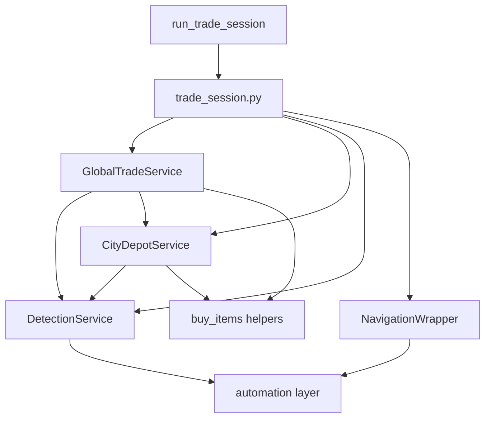

# Trade Bot

[← Back to index](README.md)

The [`simcity/bot/trade_bot/`](../simcity/bot/trade_bot/) package is a **refactored Global Trade HQ buyer** that supports multiple prioritized materials, parallel template detection, and file-based configuration. It is **not wired** to the Flask API — run it from Python scripts or integrate manually.

For API-driven single-material buying, see [`buy_items`](city-actions.md#buy_itemspy) via `CONTINUOUS_BUY`.

---

## Why it exists

| Limitation of legacy `buy_items` | `trade_bot` solution |
|----------------------------------|----------------------|
| Single material per session | Many `PurchaseItem`s with priorities |
| Sequential HQ template search | Parallel detection across all items (`ThreadPoolExecutor`) |
| Global timer key | Per-device timer via `global_trade_hq_timer_{slug}` |
| Hardcoded swipe/sleep values | `TradeBotConfig` dataclass + YAML/JSON |
| No debug captures | Optional annotated scan images per device |

`trade_bot` **reuses** buy primitives from [`buy_items.py`](../simcity/bot/city_actions/buy_items.py): `buy_item_from_visiting_city_trade_depot`, `buy_item`, and `manager` (`TimerManager`).

---

## Architecture



| Layer | Path | Role |
|-------|------|------|
| Entry | [`__init__.py`](../simcity/bot/trade_bot/__init__.py), [`run.py`](../simcity/bot/trade_bot/run.py) | Public API and dev script |
| Orchestrator | [`orchestrator/trade_session.py`](../simcity/bot/trade_bot/orchestrator/trade_session.py) | Session loop, service wiring |
| Services | [`services/`](../simcity/bot/trade_bot/services/) | HQ scan, depot sweep, detection, navigation |
| Models | [`models/`](../simcity/bot/trade_bot/models/) | `PurchaseItem`, `DetectedItem`, material facade |
| Config | [`config/`](../simcity/bot/trade_bot/config/) | Defaults, file loaders, examples |
| Utils | [`utils/`](../simcity/bot/trade_bot/utils/) | Per-device timer keys, capture storage |

---

## Public API

Exported from [`trade_bot/__init__.py`](../simcity/bot/trade_bot/__init__.py):

| Symbol | Description |
|--------|-------------|
| `run_trade_session(device_id, purchase_items, *, config, stop_event, max_session_iterations)` | Main entry — open HQ and run buy loop |
| `run_trade_session_from_files(device_id, config_path, purchase_items_path)` | Load YAML/JSON then run |
| `PurchaseItem` | Shopping list entry: `name`, `priority`, `material`, optional `template_path` |
| `purchase_items_from_specs(specs)` | Build `PurchaseItem` list from JSON/API rows |
| `TradeBotConfig` | Tunable thresholds, swipe coords, timing |
| `load_trade_bot_config(path)` / `load_purchase_items_file(path)` | File loaders |
| `DetectedItem` | Detection result model (defined; services use tuples internally) |
| `material_facade_for(item)` | Adapts `PurchaseItem` → namespace with depot/HQ templates for legacy buy functions |
| `device_id_slug(device_id)` / `global_trade_hq_timer_key(device_id)` | Per-device scoping |

---

## Session loop

`run_trade_session` in [`trade_session.py`](../simcity/bot/trade_bot/orchestrator/trade_session.py):

1. Merge config; scope `capture_device_id` per device.
2. Create per-device HQ timer.
3. Wire `DetectionService`, `NavigationWrapper`, `CityDepotService`, `GlobalTradeService`.
4. Open purchase menu → Global Trade HQ.
5. **Outer loop** (default up to 10,000 iterations):
   - Check `stop_event`.
   - Best Value → reopen HQ.
   - `global_trade.scan_trade_depot_views_and_visit(...)` — scan HQ carousel, buy, depot sweep.
   - Log per-item buy totals.

`TradeSessionState` tracks target names for a future higher-level orchestration layer; not used inside the current loop.

---

## Services

### GlobalTradeService

[`services/global_trade_service.py`](../simcity/bot/trade_bot/services/global_trade_service.py)

- **`wait_until_hq_ready`** — Poll for COIN markers; start HQ timer when view renders.
- **`scan_trade_depot_views_and_visit`** — Core HQ carousel:
  - For each HQ view (1..`hq_trade_views`): screenshot → parallel detect → pick highest priority match → visit mayor.
  - On hit: buy via `buy_item_from_visiting_city_trade_depot`, optional depot sweep for other targets, return to HQ, respect refresh timer, Best Value + reopen HQ.
  - On miss: swipe to next view; after all views empty, wait `hq_empty_pass_wait_seconds`.

### CityDepotService

[`services/city_depot_service.py`](../simcity/bot/trade_bot/services/city_depot_service.py)

- **`sweep_depot_for_targets`** — After visiting a mayor, scan up to `max_depot_pages` for remaining target items; buy via `buy_item()`; paginate when TRADE_BOX count ≥ `depot_full_page_trade_box_threshold`.
- **`return_to_global_trade_hq`** — ESC → purchase menu → Global Trade HQ.

### DetectionService

[`services/detection_service.py`](../simcity/bot/trade_bot/services/detection_service.py)

- Parallel template matching (`perform_matching`, `take_template`).
- HQ: `resolved_hq_template_path()` per `PurchaseItem`.
- Depot: depot template paths from `material_data_loader`.
- Priority sort, IoU deduplication, optional scan image saves.

### NavigationWrapper

[`services/navigation_wrapper.py`](../simcity/bot/trade_bot/services/navigation_wrapper.py)

- HQ view swipe (uiautomator2 coordinates from config).
- Mayor depot page swipe (`go_to_next_page_in_city_trade_depot`).

---

## TradeBotConfig

Defined in [`config/defaults.py`](../simcity/bot/trade_bot/config/defaults.py). Key settings:

| Setting | Default | Purpose |
|---------|---------|---------|
| `hq_trade_views` | 2 | HQ carousel pages to scan (clamped 1–6) |
| `max_depot_pages` | 3 | Max pages in visiting mayor's depot |
| `depot_full_page_trade_box_threshold` | 8 | TRADE_BOX count to assume another depot page exists |
| `match_threshold` | 0.9 | OpenCV template match threshold |
| `nms_threshold` | 0.6 | Non-max suppression |
| `dedup_iou_threshold` | 0.5 | IoU dedup across parallel detections |
| `hq_empty_pass_wait_seconds` | 30.0 | Wait after empty HQ pass before reopening |
| `hq_trade_refresh_period_seconds` | 30.0 | Refresh window after visiting a mayor |
| `hq_swipe_x1/y1/x2/y2` | 1575,460 → 620,460 | HQ carousel swipe |
| `save_scans` | False | Save annotated detection images |
| `capture_device_id` | set from `device_id` | Per-city capture folder |

Example YAML: [`config/examples/trade_bot.config.yaml`](../simcity/bot/trade_bot/config/examples/trade_bot.config.yaml).

Legacy key aliases in file loader: `max_hq_pages` → `hq_trade_views`, `hq_carousel_empty_wait_seconds` → `hq_empty_pass_wait_seconds`.

---

## How to run

### Dev script (hardcoded items)

[`trade_bot/run.py`](../simcity/bot/trade_bot/run.py):

```bash
python -m simcity.bot.trade_bot.run
```

Uses device `5605` and three storage items. Edit the file to change device or items.

### Programmatic

```python
from threading import Event
from simcity.bot.main import set_up
from simcity.bot.enums.material import Material
from simcity.bot.trade_bot import PurchaseItem, run_trade_session, TradeBotConfig

set_up("5555")
items = [
    PurchaseItem(name="bars", priority=1, material=Material.STORAGE_BARS),
]
stop = Event()
run_trade_session("5555", items, config=TradeBotConfig(hq_trade_views=3), stop_event=stop)
```

### File-based

```python
from simcity.bot.trade_bot import run_trade_session_from_files

run_trade_session_from_files(
    "5555",
    config_path="simcity/bot/trade_bot/config/examples/trade_bot.config.yaml",
    purchase_items_path="simcity/bot/trade_bot/config/examples/purchase_items.json",
)
```

Purchase items JSON format — see [`config/examples/purchase_items.json`](../simcity/bot/trade_bot/config/examples/purchase_items.json).

---

## Multi-city concurrency

Pass a **distinct `device_id`** per emulator. Timer keys and capture folders are scoped per device via [`utils/device_scope.py`](../simcity/bot/trade_bot/utils/device_scope.py). Live screenshots use the existing `screenshots/city_{device_id}/` convention.

---

## Future API integration

To expose `trade_bot` via Flask, add a new action (e.g. `TRADE_BOT_BUY`) in [`server.py`](../simcity/bot/server.py):

1. Map `selectedMaterials` + priorities to `PurchaseItem` list (or accept a config file path).
2. Call `start_action(port, run_trade_session, (port, items))` with optional `TradeBotConfig`.
3. Pass `stop_event` — `run_trade_session` already supports cooperative stop.

This wiring does **not** exist today.

---

## Related documents

- [City actions — buy_items](city-actions.md#buy_itemspy) — shared buy primitives
- [Automation](automation.md) — detection pipeline used by `DetectionService`
- [API](api.md) — current Flask actions (no trade_bot)
- [Setup](setup.md) — running prerequisites
